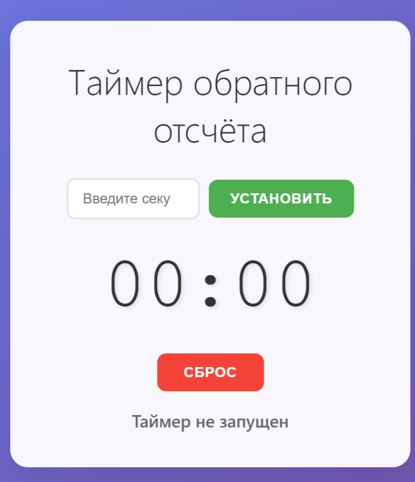
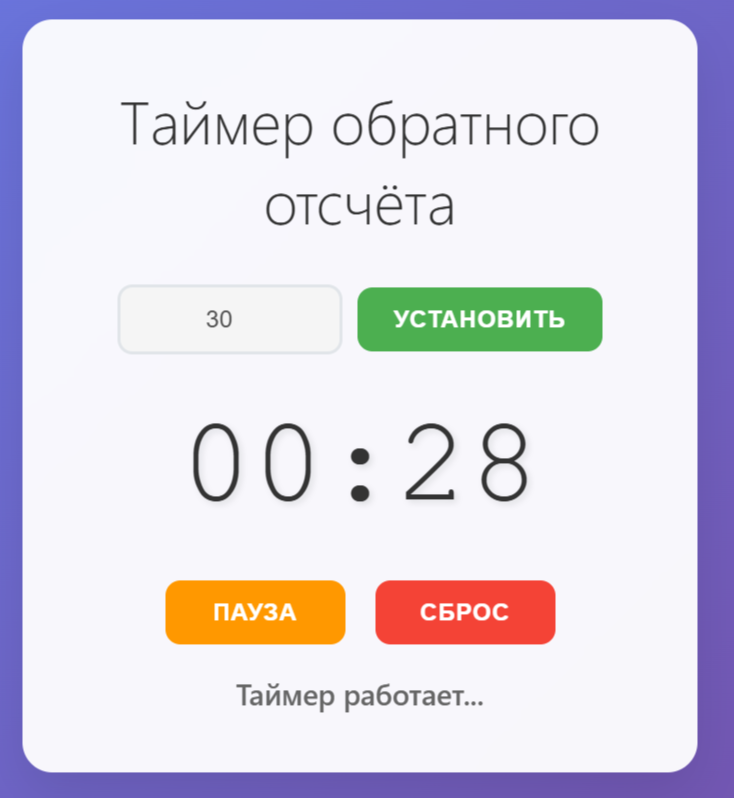
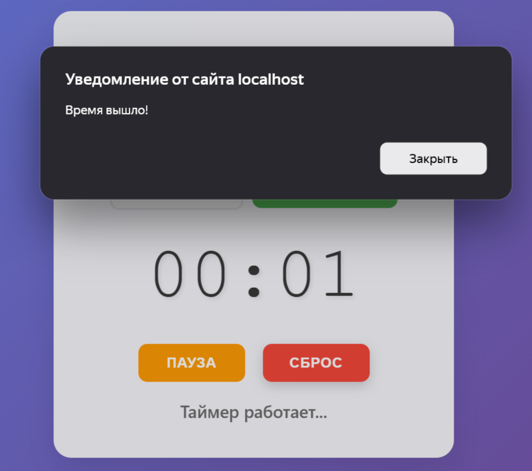

# Таймер обратного отсчёта ⏱️

React-приложение для отсчёта времени с возможностью установки секунд, паузы и сброса.

## Функциональность

- Установка времени в секундах
- Запуск обратного отсчёта
- Пауза и продолжение таймера
- Сброс таймера
- Уведомление о завершении времени

## 🖼️ Скриншоты

### Главный экран

### Таймер в работе  

### Завершение отсчёта

